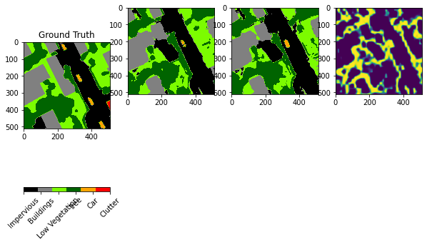
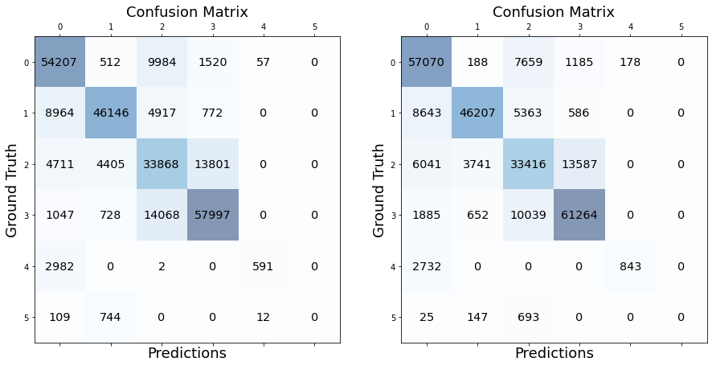

# GSUnet

Gated Shape Unet for Semantic Segmentation
Inspired from [GSCNN](https://nv-tlabs.github.io/GSCNN/)

## install

Torch: https://pytorch.org/

    pip install matplotlib tqdm sklearn
    sudo pip3 install opencv-python
    sudo pip3 install scikit-learn

CUDA : https://pytorch.org/get-started/locally/

## dataset

[ISPRS Vaihingen](https://www2.isprs.org/commissions/comm2/wg4/benchmark/2d-sem-label-vaihingen/) semantic segmentation dataset

Change the root dir of the dataset in network.dataset.vaihingen

No data augmentation is done here, it is up to you to implement it (albumentations should work)

## results

Ground truth, 30th epoch segmentation, 42th sepoch segmentation, 42th epoch edges

Confusion matrices of 30th and 42th epochs

